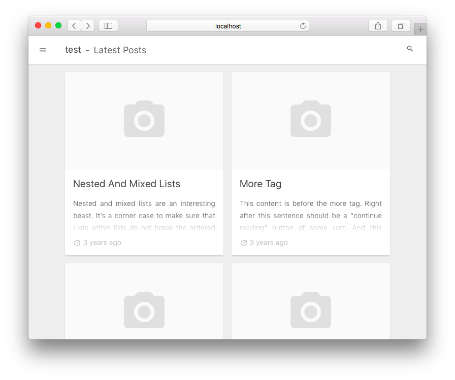

kiku
==
A Simple WordPress Theme. (for myself)

## Theme Features
* WordPress Starter Theme
 * based on [Sage - WordPress Starter Theme](https://roots.io/sage/)  
* Simple Design (Material Design)
 * use [Material Design Lite](https://getmdl.io/)
 * use [Google Material Design Icons](https://github.com/google/material-design-icons)
* Ready
 * Search Engine Optimization (SEO)
   * OGP, Twitter Cards
 * Table of Contents
 * Syntax Highlighter
   * use [Prism.js](http://prismjs.com/)
 * Share Button
   * Twitter
   * Facebook
   * Hatena
   * LINE
* Don't use jQuery (Vanilla only)
* Remove Comments function
* Fit to Japanese Language

## Requirements
Installation notes:
* [PHP](http://php.net/manual/en/install.php) >= 5.6.x
* [Composer](https://getcomposer.org/download/)
* [Node.js](http://nodejs.org/) >= 4.5
* [WordPress](https://wordpress.org/) >= 4.6.x (latest)

### Browser Support
Supported browsers: (latest)
* Chrome
* Edge
* Firefox
* Safari 10
